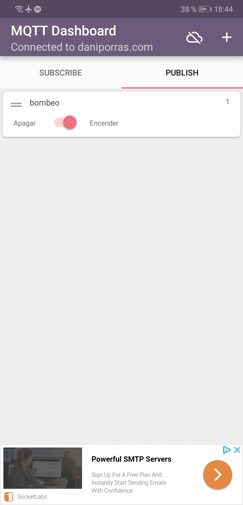

# Motivation  -Caldera-
## Description 
This project try to activate and deactivate automatically the pumping system of the heating circuit.


Also on the LCD you can see the overflow temperature of the boiler and the return temperature of the water.


The use MQTT is sent the temperature in real time and in addition you can activate and deactivate the pump by means of a mobile application.

```C
    getTemperature();
    client.publish("casa/despacho/temperatura", temperatureCString_UNO);
    
    getTemperature_DOS();
    client.publish("casa/despacho/temperatura1", temperatureCString_DOS);
    
    delay(10000);

```

## On web site
We can see on realtime the messages sent for nodemcu
```html
http://daniporras.com/mosquitto/live2.html
```


## App
With this App [MQTT Dashboard ](https://play.google.com/store/apps/details?id=com.thn.iotmqttdashboard )
we can publish messages 

